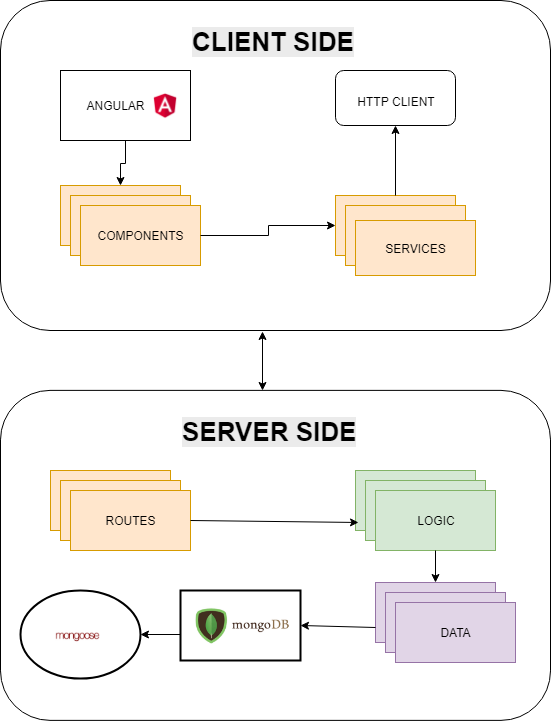

# SKYFY

## OBJETIVE

It is a digital music service with access to multiple audit tracks. In this project, it is designed to have a frontend to listen to the music, and a backend to manage artists, albums and songs.
<br>

## DESIGN (screenshots)

### Artists


### Update User


### Artist Detail | albums


### Songs


# Technologies

The main resources that have been utlizied in this project are:
- JAVASCRIPT
- ANGULAR
- NODEJS (EXPRESS, MONGOOSE, AXIOS,  BODY-PARSER, CORS, BCRYPT)
- MONGO (DATABASE)
- CSS FRAMEWORK: BOOTSTRAP

<br>

# Components

``` bh

APP
| └── LOGIN, REGISTER or REDIRECTION TO HOME.
|
|
├─── HOME
|        └── WELCOMES THE USER
|
├── USER-EDIT
│   └── UPDATE THE INFORMATION OF THE USER
│   
|                                   
├─── ARTISTS-LIST
│        ├── DELETE ARTIST
|        └── GET THE LIST OF ARTISTS
|
│                                   
├─── ARTIST-EDIT
│        └── EDIT ARTIST
|      
|
|                                   
├─── ARTIST-DETAIL
│        └── SHOW DETAILS OF THE ARTISTS AND ALBUMS
|
│                                   
├─── ARTIST-ADD
│        ├── PLAY A SONG │ 
|        └── GET THE ARTIST AND SONG
│                                   
├─── ALBUM-EDIT
│        └── EDIT THE DETAILS OF THE ALBUM
|
|                                   
├─── ALBUM-DETAIL
│        └── GET TO THE DETAIL OF THE ALBUM AND ITS CORRESPONDING SONGS
|
|
├───  ALBUM-ADD
|         └── ADD ÁLBUM
| 
│
├─── SONG-EDIT
│        ├── GET THE SONG
│        └── UPDATE THE DETAILS OF THE SONG
│
├─── SONG-ADD
│        └── ADD SONGS
│     
└─── PLAYER
         ├── PLAY SONGS │ 
         └── GET ARTIST AND SONG

         
```
<br>

## DATA MODEL


## BLOCK MODEL


## Available Scripts

In the project directory server, you can run:
### `npm start`

Runs the app in the development mode.<br>
Open [http://localhost:4200](http://localhost:4200) to view it in the browser.

In the project directory client, you can run:

### `ng serve`
to run Angular

